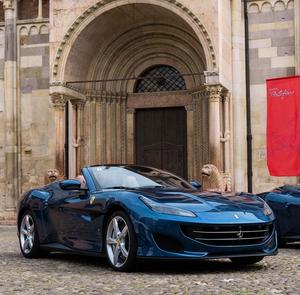
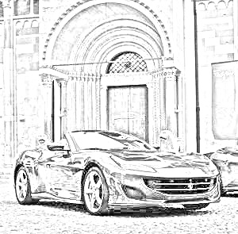

### **🖼️ Sketch Generator: Convert Images & Videos into Pencil Sketches Using OpenCV**  


## **📌 Project Description**  
This project transforms **images, videos, and live webcam streams** into **pencil sketches** using **OpenCV**. The algorithm applies **grayscale conversion, inversion, Gaussian blurring, and division-based processing** to generate a hand-drawn sketch effect.

🔹 **Converts images into pencil sketches**  
🔹 **Applies real-time sketch effects on live webcam feed**  
🔹 **Processes videos frame by frame and saves the sketched output**  
🔹 **Works efficiently with OpenCV & NumPy**  

---

## **📂 Project Structure**
```
📦 Sketch-Generator
 ┣ 📂 images
 ┃ ┣ 📄 car.jpg                # Sample input image
 ┃ ┗ 📄 cars.mp4               # Sample input video
 ┣ 📂 output
 ┃ ┣ 📄 sketched_car.jpg       # Output sketched image
 ┃ ┗ 📄 sketched_cars.mp4      # Output sketched video
 ┣ 📄 sketch_generator.py      # Main script for sketch conversion
 ┗ 📄 README.md                # Project documentation
```


## **📌 How It Works**
1️⃣ **Reads an image, video, or webcam frame**  
2️⃣ **Converts it to grayscale**  
3️⃣ **Applies inversion & Gaussian blurring**  
4️⃣ **Blends the original with the processed version to create a sketch effect**  
5️⃣ **Displays & saves the sketched output**  

---

## **📌 Setup & Installation**
Make sure you have the required dependencies installed. Run:

```sh
pip install opencv-python opencv-python-headless numpy matplotlib
```


## **📌 Running the Project**
### **1. Generate a Sketch from an Image**
Run the following command to apply the sketch effect to an image:

```sh
python sketch_generator.py --image images/car.jpg
```


### **2. Apply Real-Time Sketch Effect on Webcam**
Run this command to apply the sketch effect to a **live webcam feed**:

```sh
python sketch_generator.py --webcam
```


### **3. Convert a Video into a Sketch**
Run this command to convert a video into a **sketched animation**:

```sh
python sketch_generator.py --video images/cars.mp4
```


## **📸 Sample Results**

### **🔹 Before Transformation**
| Original Image | Original Video Frame |
|---------------|----------------------|
|  |  |


### **🔹 After Transformation**
| Sketched Image | Sketched Video Frame |
|---------------|----------------------|
|  |  |


## **🛠 Technologies Used**
- **Python** 🐍  
- **OpenCV (Image Processing)** 📷  
- **NumPy (Mathematical Operations)** 🔢  
- **Matplotlib (Visualization)** 📊  

